# Assignment 2

## Application Goal

An application that is able to switch between leisure mode and focus (work) mode. Instead of allowing social media and cellphone applications mess up our life pace, this applications return the power of time decision back to the user. Using this application makes life more efficient, but also users can also enjoy the benefit to relax when they want to. I am targetting user that would like to switch between work and rest mode often; for example, workers and students. I named this application "Grasp", because the users can now hold firmly on the control of their own life pace.

## Comparables
- **Easy access to LINE News and Instagram Reels**

| LINE | Instagram |
| ----------- | ----------- |
| 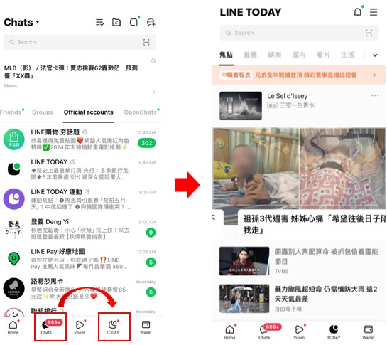|     |

In both LINE and Instagram, the applications were designed that the Instagram Reels/ LINE Zoom/ LINE Today (news) can be easily accessed from the home page. They are all located in the bottom, where the thumb can easily access when using a cellphone. This can be useful to discuss how leisure mode and focus mode should be designed.

- **Message searching system**

| LINE | Instagram |
| ----------- | ----------- |
| 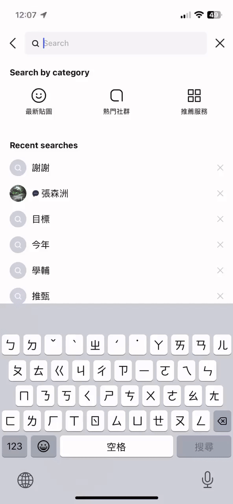 |  |

According to my interviewee, Shih-Wei, this functionality is extremely useful when he was trying to look for a message that he only remembered the approximate context but forgot the actual content. This is helpful to design a photo searching system as I mentioned in A1.

- **News Recommendation Layout**

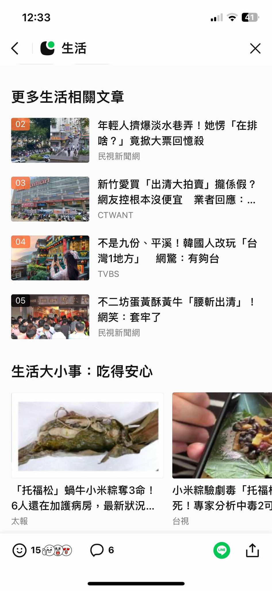 

A list of news are listed under the news that you just watched. There is a photo associate with each news recommendation. According to my interviewee, Wan-Ching, she thinks this layout took here a huge amount of time; as you might unconsciously click on to the next news. This can be used to brainstorm ideas for making this functionality less additive.

- **Multi-services Platform**

|LINE Bank | LINE Wallet| LINE Official Account|
| ----------- | ----------- | ----------- |
| 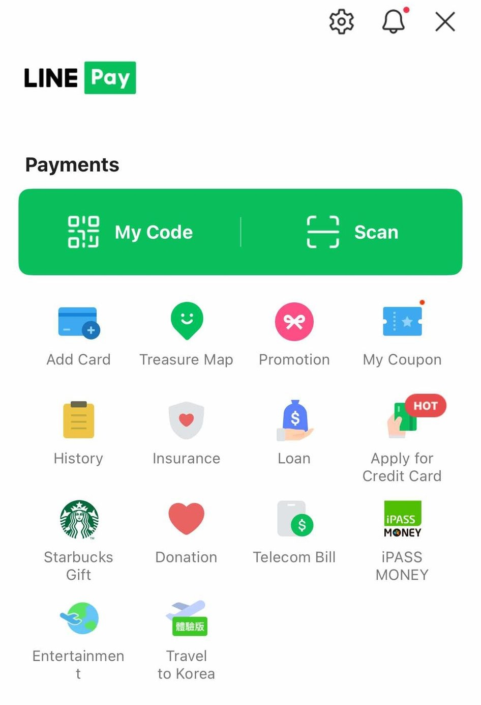 | 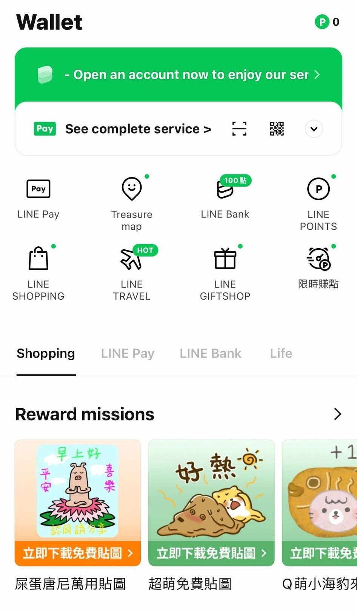 | 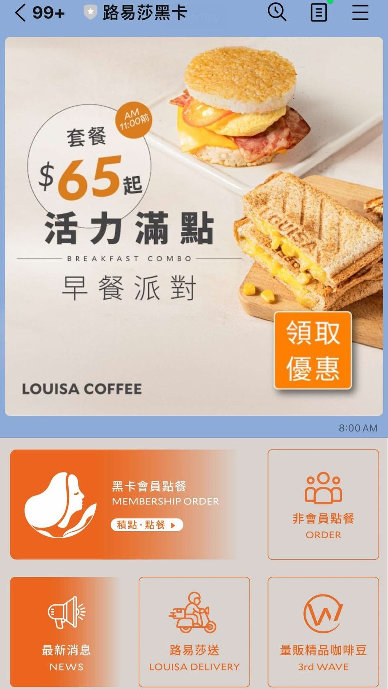

The main reason that LINE is the main social media/ chatting application in Taiwan is its multi-service platform. You can order food, make a reservation, obtain coupons, register membership in official accounts of stores. The popularity of LINE increased even more when LINE started their service for touchless payment LINE Pay, which is more common than Apple Pay or Google Pay in Taiwan. There are also gift shop, travel, credit card functionalities all in these app; yet, these are less commonly used in Taiwan. Apparantly, there are too much possible icons here, and this is for brainstorming ideas to simplify the functionalities and layout while being sufficient.

- **Archives/ Memories**

|LINE Albums| Facebook Memories|Instagram Story Archives|
| ----------- | ----------- | ----------- |
|  |  | 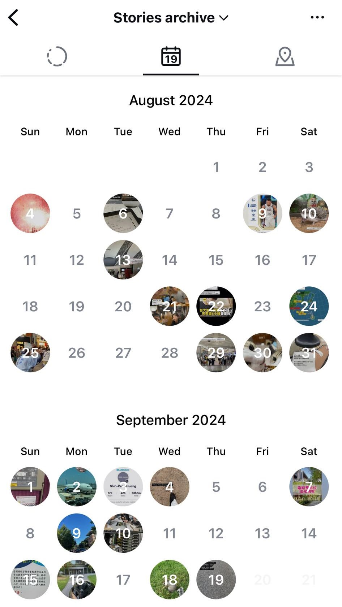

Most of the popular applications will have a way to keep the record for your past, in case you want to pull it out in the future. This is not a direct functionality for LINE, but for Taiwanese, including my interviewee Shih-Wei, it is common to store photos in album and record the date. In Facebook, information such as activity on the same day couple years ago will be recalled. In Instagram, a calendar view of stories that you have posted made it easier to go to the specific date, which I think is powerful. I would like to make sure the user can go straight to what they want and not get distracted by other functionality, which correspond to the last point I made in A1, to stop the user doing other things if they open the app with certain purpose.

## Brainstorming

- Customized layout

> You can customized your layout on the intro page of the application. Some functionality that you found disturbing can be removed from your homepage, and common ones can be placed in a more accessible position.

- News Reader

> Suggestion by Wan-Ching, if the news functionality in the application can be used while working on other things, like Podcast of spotify, one will be able to listen to the news without staring at the screen.

- Shortcut

> Inspired by shortcut functionality of IOS. Self-customized shortcut that does specific applications at once such as text someone, open account for membership.

- Map View of the Photo

> A functionality inspired by the Photos in IOS. When one forgets the specific time of a photo but remembers the event and its location, it can be retrieved through the map view.

- Single-Page Layout

> This is particularly for focus mode, where there is no functionality of scrolling. Everything necessary function is listed in a single page.

- Smart Control

> Inspired by the auto-completion functionality in Gmail. To make people only focus on the task, only give several options on the next operation. For example, after you open a photo, you can choose to save it, close it, or share it to someone with a pop-up window on the corner.

- Label the Images

> When uploading an image, you can choose add up to 5 keywords to describe this photo if this is a really important photo that you think you might use it later. You can also leave a short description for the photo.

- Pop-up Window for Leisure/Focus mode

> Force the user to select leisure mode or focus mode when first open the application. Leisure mode can not be set to default. You have to select leisure mode if you want to, with a warning under the pop-up window.

- Timer Notification

> Inspired by study applications. You can set focus time or rest time in study app to efficiently use the time. Here, in focus mode, a timer that the user can set on their own will be used to display a pop-up window when the user has been using for too long.

- Calendar

> Inspired by Outlook. Sometimes outlook sends notification 15 minutes before the event that is in your calendar starts. If we can incorporate this into the application and give reminders, which will help user better allocate time. The calender can also match labelled photos with the event.

- Summary Pop-Up Window

> When you finish using the app; for example, quit the app. It shows a summary list on what you have done today with the application, for the user to have better understanding of their activity.

- AI Detect of Image

> Inspired by IOS photos. Though it was said to be uncomfortable in the Facebook example given in lecture, the image can be labelled by the person presented or auto-generate the description when the photo was not initially labelled in the functionality that I previously mentioned.

- Functionality List

> The homepage will be a simple question that asks you to select one functionality from the list and operates it. Not all functionalities are listed in focus mode so that it is harder to get distracted.

- Membership Tab

> In LINE, all membership tab is recorded in each store's official account, which is slightly hard to know which membership you have signed up at a first glance. If the membership status can be obtained by my application, a list of current membership will be displayed, where each membership is attached with a superlink to each store's website.

- Priority Ranking

> Inspired by the Stories tab of Instagram. It seems like the person you interact more will have higher chance to be in the very front of the Stories tab. Here, the functionality that is more frequently used will be listed on the top, so the total usage time of the application can be reduced.

- Bank and Suscription

> To support multi-functionality, I would like to import a system similar to LINE Pay, where you can either deposit money or directly charge the money from your credit card. A subscription page will list all the subscription you currently have now and the bill every certain period of time.

- Weekly Report

> Inspired by IOS system. Report the usage time and number of "meaningful" operations made (for example, reached out to how many people) and define some scale of efficiency. Allow the user to share their "efficiency" which encourages peer pressure similar to "minutes listened" of Spotify's annual report. 

- Ask Friend to Focus

> You can see the status (or you can also choose to hide) of friends on whether they are in leisure mode or focus mode. Customized a message and send a pop-up window on your friends application to ask them to FOCUS! (You can block your friend of course)

- Trend Table

> A reason that my interviewee, Shih-Wei scrolls Instagram Reels is to catch up the latest trend. If there can be a "trend table" to display the current trend might save you some time.

- Focus Competition

> In focus mode, if you set a certain time period to focus, the system can pair you with someone who is also focusing. You will compete with each other, and the winner is who uses less time on the phone (if we have access) or this app. The stats of these competition will be kept to motivate people to stay focus.

- Shopping and Gift

> Inspired by LINE. A function only allows in leisure mode. This can be attached to the Bank system mentioned above. You can shop and pay with the money in your account, or send gift to your friends. 

## VSD Analysis

- Reappropriation of the Focus Mode, Non-targeted Use (Time, Stakeholders)

> When it comes to the concept "focus mode" and "select functionality you want", the first thing that comes to my mind is the MDM (mobile device management) application that all active military in Taiwan should install to their phone to limit certain functionalities. Instead of customizing the focus mode on the user's behalf, I am concerned if people other than the user have the power to limit the functionalities. This can be tackled if the app developer insisted not allowing non-users to control the setting of the users.

> The original intention for users to label their photo is for more efficient access to photos that the user want. A potential reappropriation is that the user uses this functionality as a travel diary, or to record whatever the user wants to take note of, for example, the WiFi password for a certain restaurant.

> The "Ask Friend to Focus" is something similar to "Poke" in early Facebook, which the intention is to connect friends and have fun. However, this can be used for parent or teachers to monitor childrens' application usage status.

- Choosing Not to Use, Widespread Use (Time, Pervasiveness)

> This is in a similar situation for people that is not having LINE in Taiwan. It is sometimes required to have an account to make reservation. The solution is that if you are reserving a place requiring this app "Grasp", a guest reservation system will appear if you do have this app installed. 

> Also, not using this application might take you more time to understand the current trend, which results in higher cost to understand what peers are saying.

> If this application becomes common and one does not install this application intentionally, then it might be harder for one to form a group chat or to connect with others on the Internet. One might lose an oppotunity to take a step closer; instead, retreat back to Professional applications like LinkedIn or only use email to communicate. This application is defined to be between informal chat application like Instagram and formal applications like LinkedIn or Slack.

- Work of the Future (Time)

> I can imagine an huge increase in work productivity for work-from-home and students if this application becomes mainstream. People do not have to take the phone as far as possible to avoid distraction at work. Companies can form a group chat, where purchases can be made in the application and directedly send to the employees, making the transaction transparent and efficient. However, it is also possible that company requires employee to do a group competition of "focus-ness". It should be an entertain-oriented use, but some bosses might emphasize this and deduct the bonus from the least-focusing employees...

- Value Tensions (Values)

> When I asked my interviewee Wan-Ching about whether she is willing to have a reminder in her application, she refused, which made me surprised. There are users who do not want to be controlled by the application and use whatever the functionalities they desire; yet, there are also users who prefer the application to do some controlling for them. That is why I decided to have a focus mode and a leisure mode.

> As I mentioned in the "work of the future", this can be a way for companies to monitor their employees during the "work from home" working hours, which seems to violate the employee's privacy. Some users want to see who is online in "leisure mode" to chat, but some users values their privacy and would like it not being shown. Hence, I think user should be able to select whether they would like to control whether their mode is visible.

- Political Realities, Indirect Stakeholders (Pervasiveness, Stakeholders)

> For example, demographic structures are extremely different in LINE's news section and in Threads' user. LINE's news section users are generally older and conservative, who think very traditionally and do not like something new. Yet, Thread's user are extremely young and thinks independently (and a little hostile). My mother does not read Threads and my younger brother does not read LINE's news because the content and the comments are too far away from their perspective. The echo chamber becomes thicker and differentiation of Taiwanese becomes more serious, which was actually reflected in this year's Taiwan's presidential election. If this application becomes popular, it might gather the workers and students since they are the most expected users.

> The journalism ethics in Taiwanese news is horrendous as the biggest news companies are funded by parties with specific ideals (or political parties). They supported their own political ideals by news and gather a group of supporters. Some of the major news also have clickbait that intentionally mislead readers. If I have a news section in my application, I should filter the news content so that it does not attract a certain group of user. Yet, this might depend by the investors' stance if this application become mainstream.

## Storyboarding and Sketching

- Selection between focus mode and leisure mode.

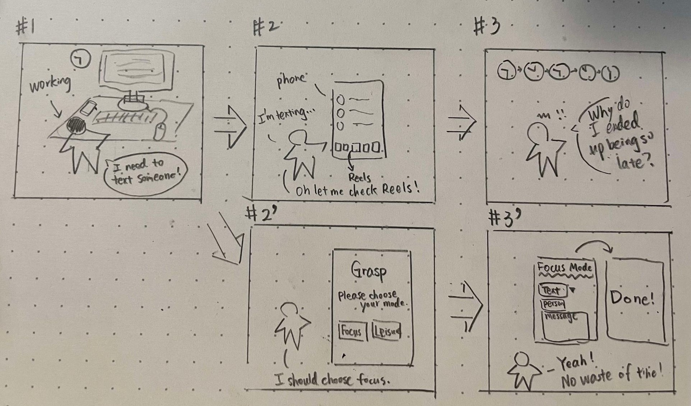

> #1 Brian suddenly realized that he needs to text someone when he is working. 

> #2 Brian saw the Reels button when he opens the application and pressed it unconsciously.

> #3 Time passed and Brian's time disappeared unconsciously as well.

> #2' Brian used Grasp, and he knew he should press on Focus mode before he got distracted by other functions in the application.

> #3' A simple interface is displayed. Brian can simply text the person by selecting the action he wants to. He closed the application and get back to work right after.

This is a little bit unclear in the cases where it is not the user who initiates the action; for example, when you receive a message, how should it be displayed on the simplified interface? This should be considered more in the next stage design.

- Photo Search.

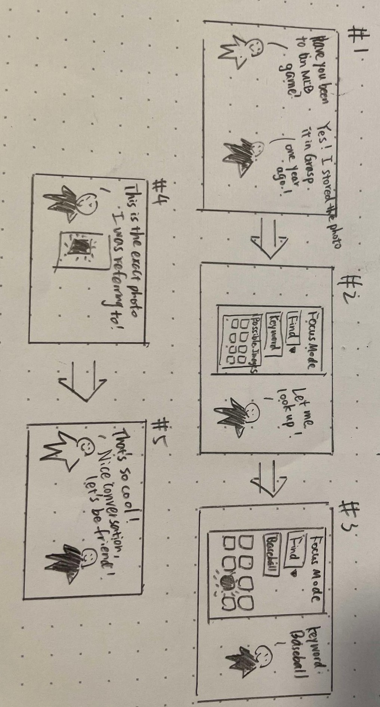

> #1 White asks Black if he has been to an MLB game before. Black has a specific image that comes to his mind that he thinks it will be cool to show White.

> #2 Black looks up in Grasp by typing the keyword and use the "search photo" operation in the simplified interface.

> #3 Black can try all different words that it might associate with that picture in mind.

> #4 Black finds the exact photo that he was thinking of.

> #5 White is impressed by the photo and the speed of Black finding this photo. They become friends.

The approach was to let user to label each photos with keywords; however, when the word does not match perfectly, how should the searching result of the photos be like? For example, if you labelled "ballpark" but try to search "baseball field" in the future, how should the system be designed? This also happens in the current message searching system.

- News Reader.

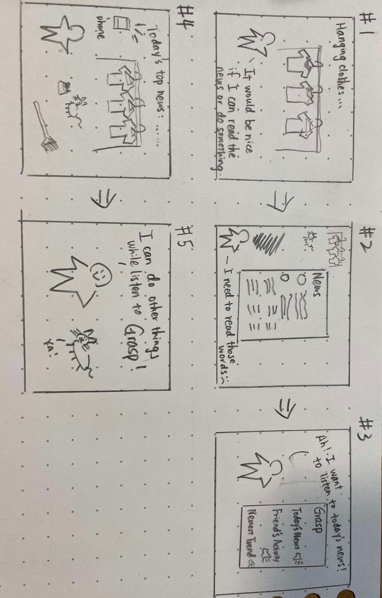

> #1 Mom is hanging clothes and doing housework. She wants to read some news.

> #2 Mom turned on the news application. It is full of text and she have to read it to understand it, meaning that she could not do other things at the same time.

> #3 Fortunately, Grasp provides functionalities such as news reader, friends' activity reader, and trends reader, where you can catch up the latest news around you without staring at the phone.

> #4 Mom finished hanging the clothes, feeding the cat, and sweeping the floor while listened to all updates from her friends and local news.

> #5 Mom is happy. Cat is happy.

The difference between this news reader system and simply playing the news channel in the background should work similarly. As a result, I think adding friends activities and trends reader makes it more unique. However, how users post their updates and how we organize them to present to the user might require more designing work. In this case, this application should only allow users to post their updates in text, like Twitter or Threads; as the Instagram Stories is focused on visualizations. There should also existing a "Trends Unit" who organize the current trends into a readable format.

- Ask Friends to Focus

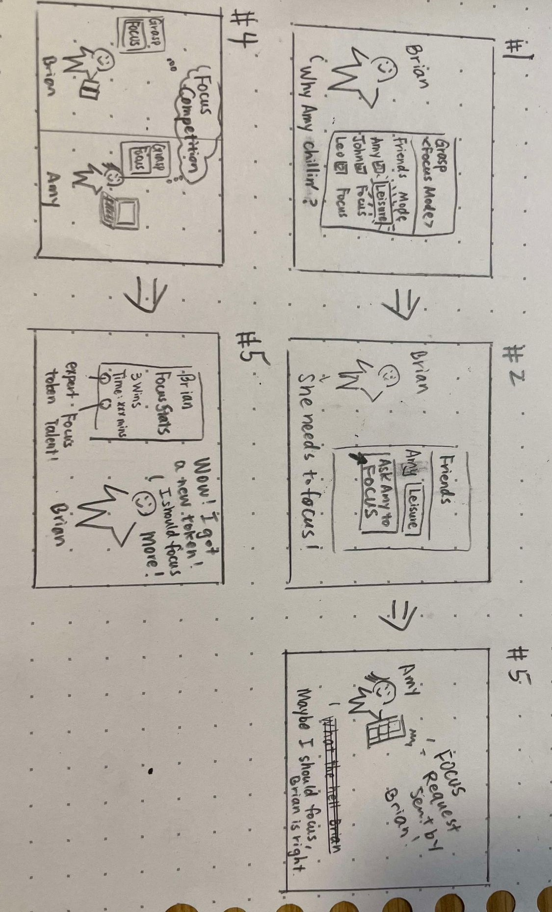

> #1 Brian is not satisfied because Amy is on leisure mode in Grasp. It is hard for people to work hard while seeing their best friends chilling.

> #2 Brian pressed the "Ask Amy to Focus" button!

> #3 A pop-up window showed in Amy's screen. Amy either felt bothered or realized that she should actually be focused. 

> #4 If she decides to turn on the focus mode, she can also host a "focus competition" with Brian, where they challenge each other to stay away from the phone.

> #5 Brian can see his focus stats and might motivate him to focus more.

This combines two ideas, "ask friend to focus" and "focus competition". Both ways interact with friends and construct a community of your own. However, this is not clear about the rules of the focus competition: does this only includes usage of this application? If so, user can just move to another application. Also, when a friend asks you to focus, how big should the pop-up window be? Should it be covering the whole screen so the user should make a decision? These design details will be covered in the next assignment.