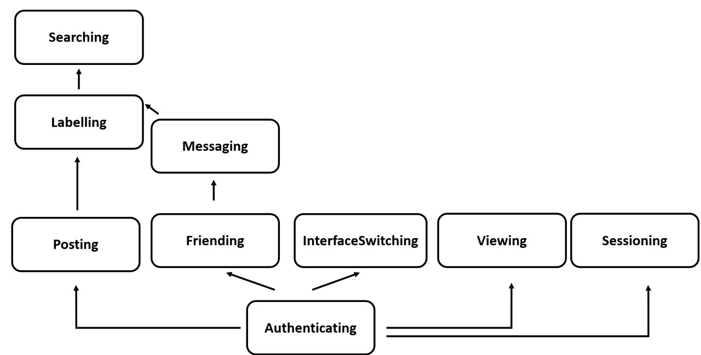

# Assignment 3: Convergent Design

## Pitch

This application, Grasp, is designed for people who need to communicate in personal life but also need time to focus. We all have experience that we intended to just send a message to a friend, but ended up scrolling videos and posts for an hour. In Grasp, you do not have to worry!

The most interesting part of it is that you can switch between Focus Mode and Leisure Mode. In Focus Mode, everything operation you are doing, such as texting someone, posting, reading other's update, will be straightforward. All the factors that will distract you are removed in the focus mode. You will never lose your time unconsciously anymore! Of course, if you are here just to relax, Leisure mode is here for you. Grasp works like other common application, where you can message someone, add friend, post, and share content with your friends.

## Functional Design

Concepts are listed here for the prototype of Grasp.

### 1. Friending[User]

**Purpose:** 
> to grant access to other user to see oneself's activity and see others

**Principle:**
> If User a and User b are friend, the pair (a,b) or (b,a) will be stored in the friend database.

**State:**
> friendData: set (User, User)
> items: User -> set Item

**Actions:**

- addFriend(self: User, friend: User)
> friendData += (self, friend)

- removeFriend(self: User, friend: User)
> for userPair in friendData \
> &emsp; if (userPair == (self, friend) or userPair == (friend, self)) \
> &emsp; &emsp; friendData -= userPair

- checkFriend(self: User, toCheck: User, out b: Boolean)
> for userPair in friendData \
> &emsp; if (userPair == (self, friend) or userPair == (friend, self)) \
> &emsp; &emsp; out := true \
> &emsp; &emsp; return \
> out := false

### 2. Posting[User]

**Purpose:**
> To create content for various potential purposes.

**Principle:**
> A posted item i will stored under the author u. Author u possesses the item i. Adding i to your collections.

**State:**
> registeredUsers: set User \
> posts: registeredUsers -> set Item;

**Actions:**

- Post (u: User, i: Item)
> for user in registeredUsers \
> &emsp; if user == u \
> &emsp; &emsp; u.posts += i

- DeletePost(u: User, i: Item)
> for user in registeredUsers \
> &emsp; if user == u \
> &emsp; &emsp; u.posts -= i

- FindAuthor(i: Item, out author: User)
> for user in registeredUsers \
> &emsp; if i in user.posts\
> &emsp; &emsp; author := user
### 3. Authenticating

**Purpose:**
> Correspond the user of the app to real people.

**Principle**
> If one registers with a username and a password to make a user, one can access that user with a same pair.

**State**
> registeredUsers: set User \
> username: registeredUsers -> one String \
> password: registeredUsers -> one String 

**Actions**

- register(name: String, pass: String)
> name not in registeredUsers.name \
> user.username := name \
> user.password := pass \
> registeredUsers += user

- unregister(name: String, pass: String)
> user in registeredUser \
> if user.username == name and user.password == pass\
> &emsp; registeredUsers -= user

- authenticate(name: String, pass: String, out u: User)
> user in registeredUser \
> if user.username == name and user.password == pass \
> &emsp; u := user

### 4. Sessioning[User]

**Purpose:**
> Extend authenticated actions for the user that has previously authenticated.

**Principle**
> After a session starts, getUser action returns the user identified in the same session.

**State**
> active: set Session \
> user: active -> one User

**Actions**
- start(user: User, out sess: Session)
> sess.user := user
> active += sess

- getUser(sess: Session, out user: User)
> for session in active
> &emsp; if (session == sess)
> &emsp; &emsp; user := session.user

- end(sess: Session)
> sess in active
> active -= sess

### 5. Interfaceing

**Purpose**
> Serve as different "modes" in the application.

**Principle**
> If a user u changes to interface i, u.interface = i; 

**State**
> registeredUser: set User \
> interface: registeredUser -> One Interface

**Actions**
- switch(u: User, i: Interface)
> for user in registeredUser \
> &emsp; if user == u: \
> &emsp; &emsp; u.interface := i

- findInterface(u: User, out i: Interface)
> for user in registeredUser \
> &emsp; if user == u: \
> &emsp; &emsp; i := u.interface

- getInterfaceOwner(i: Interface, out owner: User)
> for user in registeredUser \
> &emsp; if i in user.Interface: \
> &emsp; &emsp; owner := user

### 6. Labelling[Item]
**Purpose**
> To record keywords or information of items. 

**Principle**
> A label l is attached with the item i when being labelled.

**State**
> registeredUser: set User \
> items: registeredUser -> set Item \
> label: item -> set String

**Actions**
- addLabel(i: Item, l: String)
> for item in items \
> &emsp; if i == item: \
> &emsp; &emsp; i.label += l

- unlabel(i: Item, l: String)
> for item in items \
> &emsp; if i == item: \
> &emsp; &emsp; l in i.label \
> &emsp; &emsp; i.label -= l

- getLabel(i: Item, labels: Array(String))
> labels := i.label

### 7. Searching[Label]
**Purpose**
> Check the items in a list about whether they have the requested information.

**Principle**
> Given a list of items and a search request r, check whether the items in the list is related to the search request r.

**State**
> items: set Item
> label: item -> set String

**Actions**
- searchItem(request: String, l: label, out i: Item)
> for item in items \
> &emsp; if (l in item.label) \
> &emsp; &emsp; i := item 

### 8. Messaging[User]
**Purpose**
> Communicate with other users by sending message directly to another user.

**Principle**
> If an item i is sent from a sender s to receiver r, Conversations\[(s,r) or (r,s)\] will stored i.

**State**
> Conversations: Map (User, User) -> set Item\
> sender: Item -> one User
> receiver: Item -> one User

**Actions**
- sendMessage(sender: User, receiver: User, message: Item)
> message.sender := sender \
> message.receiver := receiver \
> for k in Conversations \
> &emsp; if (k == (sender, receiver) or k == (receiver, sender)) \
> &emsp; &emsp; Conversation[k] += message \
> &emsp; &emsp; return \
> Conversations[(sender, receiver)] := message

- removeMessage(sender: User, message: Item)
> for k in Conversations \
> &emsp; if (sender in k and Conversations[k].sender == sender) \
> &emsp; &emsp; Conversation[k] -= message

- ownsMessage(user: User, message: Item, out ownsMessage: bool)
> ownsMessage := (user == message.sender or user == message.receiver)

- getAllMessage(user: User, out userAllMessage: Array(Item))
> for k in Conversations \
> &emsp; if (sender in k and Conversations[k].sender == sender) \
> &emsp; &emsp; userAllMessage += Conversation[k]

### 9. Viewing
**Purpose**
> For a user to view something in the app.

**Principle**
> Given a list of items and a filter that , decide what items can be seen.

**State**
n/a

**Actions**
- view(Items: array(Item), viewFilter: array(bool), out itemCanView: array(Item))
> itemCanView := Items.filter(viewFilter)

### Dependency Graph

The dependncy graph of the basic concepts is shown below.

## Functional Design (App)

### 1. Accessing
- **Purpose: Check whether a user can reach to the item.**
- **include** Friending, Viewing, Posting, Messaging, Interfacing
- **sync** accessPost(user: User, targetPost: Item, out outItem: Item?)
> Posting.FindAuthor(targetPost, author) \
> Friending.checkFriend(user, author, canView: boolean) \
> Viewing.view(targetPost, canView, outItem)

- **sync** accessMessage(user: User, targetMessage: Item, out outItem: Item?)
> Messaging.ownsMessage(user, targetMessage, canViewMessage: boolean)
> Viewing.view(targetPost, canView, outItem)

- **sync** accessInterface(user: User, targtInterface: Interface, out outItem: Item?)
> Interfacing.getInterfaceOwner(targetInterface, owner) \
> Friending.checkFriend(user, owner, canView: boolean) \
> Viewing.view(targetInterface, canView, outItem)

### 2. Referring/Sharing/Forwarding
- **Purpose: For a user to share content to another user, where the content should be accessible by both.**
- **include** Accessing, Messaging  
- **sync** sharePost(sender: User, toSend: User, post: Item)
> Accessing.accessPost(user, post, post)
> Accessing.accessPost(toSend, post, post)
> Messaging.sendMessage(sender, toSend, post)

- **sync** mentioningInterface(sender: User, toSend: User, interface: Item)
> Accessing.accessInterface(user, tosender, interface)
> Messaging.sendMessage(sender, toSend, interface)

### 3. SearchingWithLabel
- **Purpose:Search the content to see if it matches certain label.**
- **include** Labeling, Searching, Posting, Messaging
- **sync** searchPost(user: User, request: String, out posts: Array(Item))
> Posting.getPosts(user, allPostsFromUser)
> for postFromUser in allPostsFromUser
> &emsp; Labeling.getLabel(postFromUser, label)
> &emsp; Searching.searchItem(request, label, outItem)
> &emsp; posts += outItem;

- **sync** searchMessage(user: User, request: String, out messages: Array(Item))
> Messaging.getAllMessage(user, userAllMessage)
> for userMessage in userAllMessage
> &emsp; Labeling.getLabel(userMessage, label)
> &emsp; Searching.searchItem(request, label, outItem)
> &emsp; messages += outItem;

## Wireframing
[Wireframing Prototype](https://www.figma.com/proto/jTsOzp5z8EiDOm5v1SJ456/Untitled?node-id=1-2&node-type=frame&t=Bu929OFqassbeT0v-1&scaling=scale-down&content-scaling=fixed&page-id=0%3A1&starting-point-node-id=1%3A2)

Contains basic operations in focus mode and leisure mode. Some of the buttons are not implemented because only the representative functions are implemented.

You should be able to see Friending, SearchingWithLabel, Interfacing, Posting, Labelling, Messaging in the wireframe.

## Design Tradeoff

1. Clicks to Leisure Mode

**Options** \
("Back" go to mode selection page.)
> 1. Having the pink "Back" button on all of the windows./
> 2. Having the pink "Back" button only on Leisure mode and main page of Focus mode, and have a "Go to Focus Main Page" button after you finished an operation./
> 3. Having the pink "Back" button only on Leisure mode and main page of Focus mode, and have a "Go to Focus Main Page" button on all other Focus mode windows./
> 4. When getting into Leisure model, show a pop-up window saying "Do you really want to go to Leisure mode?"

**Rationale**
> This is a tradeoff between convenience and refraining users from easy switching to Leisure mode. In option 1, if all windows have the back button, the user can go to leisure mode in two clicks. Yet in option 2, you are forced to do some operations before you can switch different mode. Comparing to option 1, option 1 needs another click ("Go to Focus Main Page") for user to go to leisure mode, which slightly increases the inconvenience for user to switch, but fulfills my goal that user will not be start scrolling unconsciously. Option 4 will be inconvenient to those who come to this app just to spend their time in leisure mode, so I ended up using option 3.

2. Interface of Focus Mode

**Options** \
> 1. Looks like a search bar.
> 2. Simpler version that resembles major social media but cannot scroll. Instead, you will need to flip page.

**Rationale**
>  I would like my focus mode to have no scrolling function at all. Decided to use a search bar. It is more straightforward but less interactive. The user might feel harder to use at first because it does not resemble typical social media. However, I think this can be a thing that user can overcome over time because the operations are straightforward, and most of the operations can be done in several clicks.

3. Labelling

**Options** \
> 1. Label on the post/ message.
> 2. Label on the image inside the post.

**Rationale**
>  It is more like a design choice rather than tradeoff. The post are usually associate with texts, so I think it is a little unnecessary. I don't think the user will type similar content twice. If it is the photo inside the post that is labelled, the searching functionality can be looking into a gallery of photos, which I think is pretty useful.

