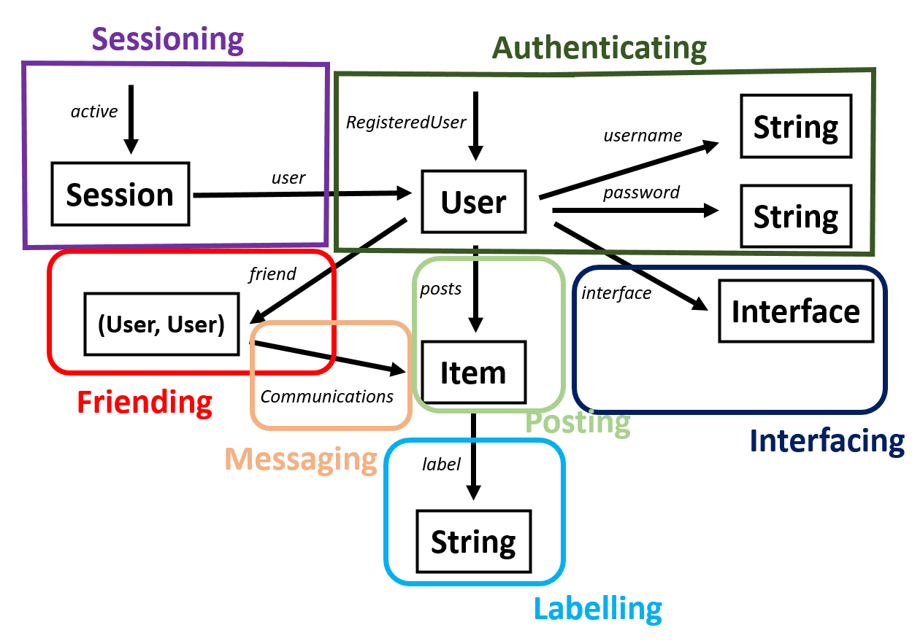

# Assignment 4: Backend Design

## Abstract Data Model Update

The general content of the abstract data model is similar to A3; yet, some modifications are made.
Searching Concept is removed and operations are combined to Labeling Concept.
Concepts are listed here for the prototype of Grasp.

### 1. Friending[User]

**Purpose:** 
> to grant access to other user to see oneself's activity and see others

**Principle:**
> If User a and User b are friend, the pair (a,b) or (b,a) will be stored in the friend database.

**State:**
> friendData: set (User, User)

**Actions:**

- addFriend(self: User, friend: User)
> friendData += (self, friend)

- removeFriend(self: User, friend: User)
> for userPair in friendData \
> &emsp; if (userPair == (self, friend) or userPair == (friend, self)) \
> &emsp; &emsp; friendData -= userPair

- checkFriend(self: User, toCheck: User, out b: Boolean)
> for userPair in friendData \
> &emsp; if (userPair == (self, friend) or userPair == (friend, self)) \
> &emsp; &emsp; out := true \
> &emsp; &emsp; return \
> out := false

### 2. Posting[User]

**Purpose:**
> To create content for various potential purposes.

**Principle:**
> A posted item i will stored under the author u. Author u possesses the item i. Adding i to your collections.

**State:**
> postingUsers: set User \
> posts: postingUsers -> set Item;

**Actions:**

- Post (u: User, i: Item)
> for user in postingUsers \
> &emsp; if user == u \
> &emsp; &emsp; u.posts += i

- DeletePost(u: User, i: Item)
> for user in postingUsers \
> &emsp; if user == u \
> &emsp; &emsp; u.posts -= i

- FindAuthor(i: Item, out author: User)
> for user in postingUsers \
> &emsp; if i in user.posts\
> &emsp; &emsp; author := user

### 3. Authenticating

**Purpose:**
> Correspond the user of the app to real people.

**Principle**
> If one registers with a username and a password to make a user, one can access that user with a same pair.

**State**
> registeredUsers: set User \
> username: registeredUsers -> one String \
> password: registeredUsers -> one String 

**Actions**

- register(name: String, pass: String)
> name not in registeredUsers.name \
> user.username := name \
> user.password := pass \
> registeredUsers += user

- unregister(name: String, pass: String)
> user in registeredUser \
> if user.username == name and user.password == pass\
> &emsp; registeredUsers -= user

- authenticate(name: String, pass: String, out u: User)
> user in registeredUser \
> if user.username == name and user.password == pass \
> &emsp; u := user

### 4. Sessioning[User]

**Purpose:**
> Extend authenticated actions for the user that has previously authenticated.

**Principle**
> After a session starts, getUser action returns the user identified in the same session.

**State**
> active: set Session \
> user: active -> one User

**Actions**
- start(user: User, out sess: Session)
> sess.user := user
> active += sess

- getUser(sess: Session, out user: User)
> for session in active
> &emsp; if (session == sess)
> &emsp; &emsp; user := session.user

- end(sess: Session)
> sess in active
> active -= sess

### 5. Interfaceing[User]

**Purpose**
> Serve as different "modes" in the application.

**Principle**
> If a user u changes to interface i, u.interface = i; 

**State**
> interfaceUser: set User \
> interface: interfaceUser -> One Interface

**Actions**
- switch(u: User, i: Interface)
> for user in interfaceUser \
> &emsp; if user == u: \
> &emsp; &emsp; u.interface := i

- findInterface(u: User, out i: Interface)
> for user in interfaceUser \
> &emsp; if user == u: \
> &emsp; &emsp; i := u.interface

- getInterfaceOwner(i: Interface, out owner: User)
> for user interfaceUser \
> &emsp; if i in user.Interface: \
> &emsp; &emsp; owner := user

### 6. Labelling[Item]
**Purpose**
> To record keywords or information of items. 

**Principle**
> A label l is attached with the item i when being labelled.

**State**
> labelItems: set Item
> label: item -> set String

**Actions**
- addLabel(i: Item, l: String)
> for item in labelItems \
> &emsp; if i == item: \
> &emsp; &emsp; i.label += l

- unlabel(i: Item, l: String)
> for item in labelItems \
> &emsp; if i == item: \
> &emsp; &emsp; l in i.label \
> &emsp; &emsp; i.label -= l

- getLabel(i: Item, labels: Array(String))
> labels := i.label

- searchItem(l: label, out i: Item)
> for item in labelItems \
> &emsp; if (l in item.label) \
> &emsp; &emsp; i := item 

### 7. Messaging[User, Item]
**Purpose**
> Communicate with other users by sending message directly to another user.

**Principle**
> If an item i is sent from a sender s to receiver r, Conversations\[(s,r) or (r,s)\] will stored i.

**State**
> Conversations: Map (User, User) -> set Item\
> sender: Item -> one User
> receiver: Item -> one User

**Actions**
- sendMessage(sender: User, receiver: User, message: Item)
> for k in Conversations \
> &emsp; if k === (sender, receiver) \
> &emsp; &emsp; Conversation[k] += message \
> &emsp; &emsp; return \
> Conversations[(sender, receiver)] := message

- removeMessage(sender: User, message: Item)
> for k in Conversations \
> &emsp; if (k[0]==sender and Conversations[k] === message) \
> &emsp; &emsp; Conversation[k] -= message

- ownsMessage(user: User, message: Item, out ownsMessage: bool)
> ownsMessage := (user == message.parent[0] or user == message.parent[1])

- getAllMessage(user: User, out userAllMessage: Array(Item))
> for k in Conversations \
> &emsp; if (sender in k) \
> &emsp; &emsp; userAllMessage += Conversation[k]

### 8. Viewing
**Purpose**
> For a user to view something in the app.

**Principle**
> Given a list of items and a filter that , decide what items can be seen.

**State**
n/a

**Actions**
- view(Items: array(Item), viewFilter: array(bool), out itemCanView: array(Item))
> itemCanView := Items.filter(viewFilter)

### Diagram of the States.

The states of the app can be represented as the following diagram.

