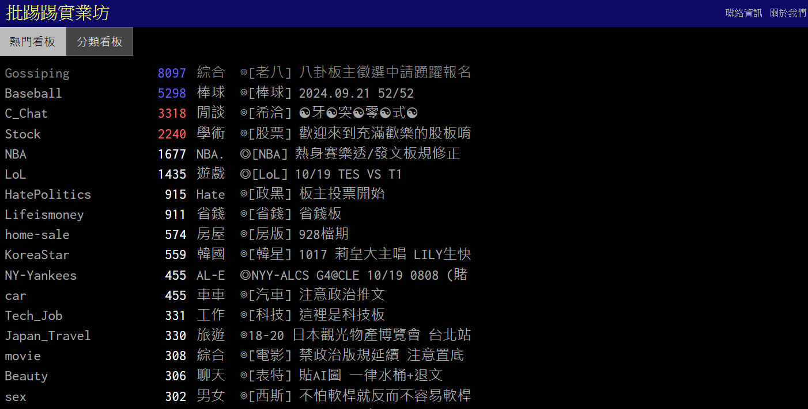
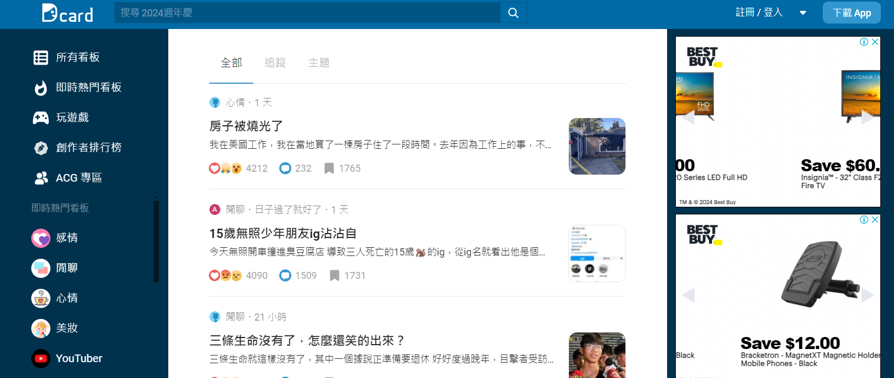
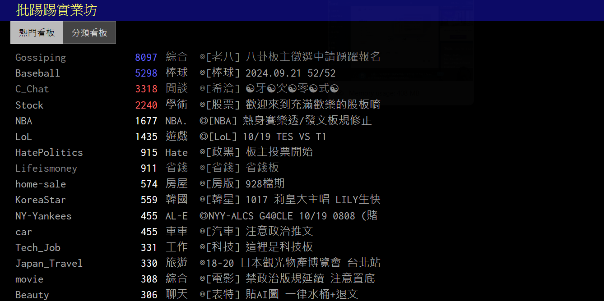
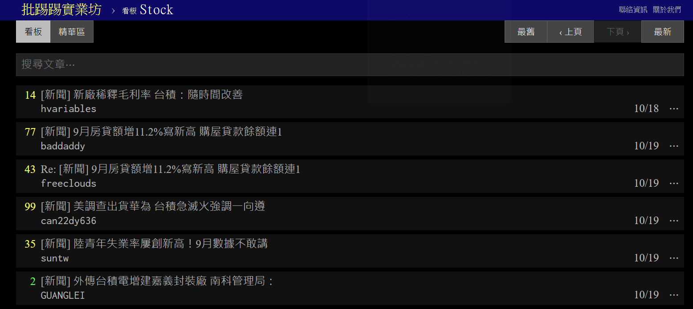
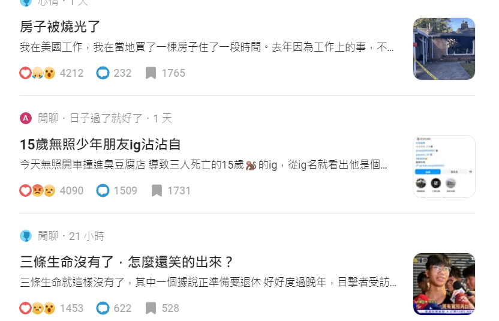

#  UI Visual Design - Downfall of ptt.cc and Success of Dcard

## Introduction

Ptt and Dcard are two popular applications which targets younger generations in Taiwan. Unlike applications across international markets, the contents in those applications are very limited to Taiwanese.

### Ptt.cc
Ptt is a bulletin board system (BBS) that was created by a sophomore from NTU (National Taiwan University) named Panda Tu in 1995. It was originally created for non-profit, academic usage in NTU. Now, it is open to public and you can read posts which are categorized into different topics. User can upvote or downvote a post by commenting, where your vote will be shown right next to your comment.

### Dcard

Dcard is a social media app created by NTU students Kytu Lin and Chin-Yu Chien in 2011. It was originally limited to NTU and NCCU students, and now it is open to public. You can also read posts which are categorized into different topics. Each school also have their own bulletin board, where only students from that school can post and comment.

One interesting feature in Dcard is that before every midnight, you will receive a anonymous friend request. Both of you will need to approve the request before midnight to become a friend; otherwise, you will never get the request from the same person again. 

## Comparison

I saw a post on Dcard, saying that Dcard is just more commercial version of ptt with better UI. In terms of the functionality and their origin, they do share a lot of commonality. In 2019, according to Alexa, a website to monitor world websites, Dcard has surpassed Ptt to become the 14th most popular (vs. 22nd) website in Taiwan.

One of the reason was said to be the UI/UX design, annd here I would like to show a couple more examples.

### Grid/ Arrangement

In Dcard, there is a nice three-column grid arrangement. The left most column contains some tabs for you to select the category you are interested in. The central column is the largest and takes about two-thirds of the entire screen space, where the contents are placed in. The right column has some advertisement.

While in Ptt, it is always one column. You first start with the category selection page that are listed in a long column; after you select one, you can view the posts of that category, which are also listed in a single long column.

Here you select one category:

Now you are in the stock categories, where you can see posts related to stock.

### Post Preview

Both ptt and Dcard can include photo or videos in the post. But Dcard has a small image preview so the user can build better image on the post's content, it also includes the first sentence of the post; where ptt only has the title and the author of the post.

In terms of the F-pattern that was mentioned in class, the way how Dcard arranged their layout was actually optimal to our habits: we look at the title, moves all the way right to the image, and then move down. Where in ptt, it was just hard to read all the texts that are somehow too close to each other.

### Summary

This is somehow inevitable because Dcard has been commercialized into different sector now and has a huge team to constantly updating their UI design, while ptt remains non-profit and the owners/engineers of ptt are all working on some other full-time jobs.

In face, I have never gotten familiar with ptt because it was actually hard for a new user like me. Yet, I am a frequent user of Dcard since 3 or 4 years ago. The UI design and the principles mentioned in class did make a lot of difference on my usage between these two applications.

## References

- https://blog.hamibook.com.tw/%E6%96%B0%E8%81%9E%E6%99%82%E4%BA%8B/dcard%E3%80%8C%E8%B6%85%E8%BB%8A%E3%80%8Dptt%E7%9A%84%E4%B8%89%E5%A4%A7%E7%A5%95%E5%AF%86#:~:text=%E7%9B%A3%E6%B8%AC%E5%85%A8%E7%90%83%E7%B6%B2%E7%AB%99%E7%9A%84Alexa,PTT%E7%9A%84%E7%AC%AC22%E5%90%8D%E3%80%82

- https://www.dcard.tw/f/mood/p/238078693

- https://today.line.me/tw/v2/article/DkRk2W