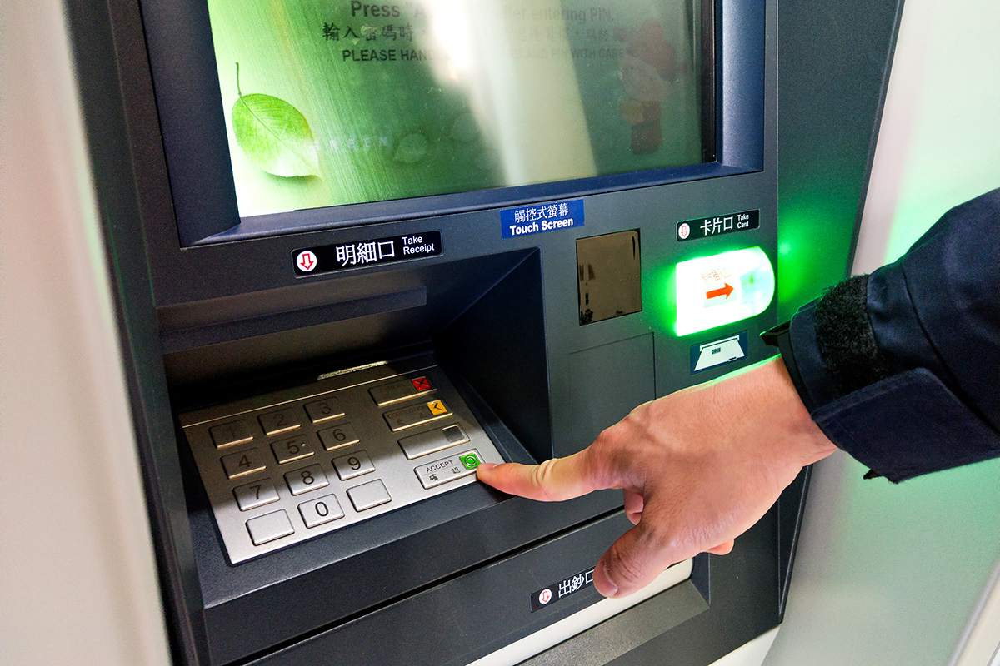
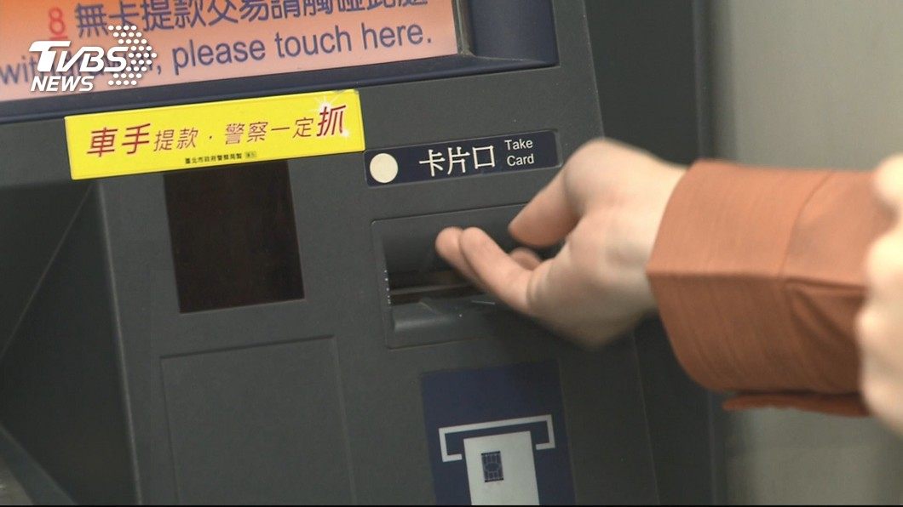
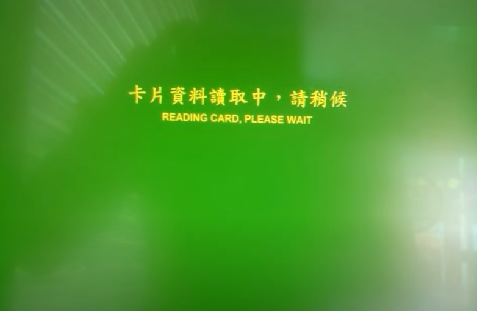
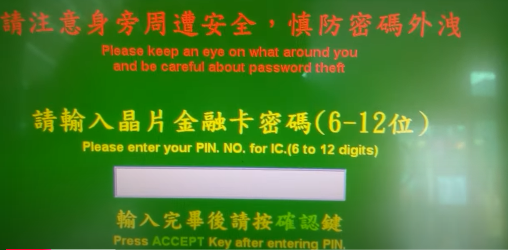
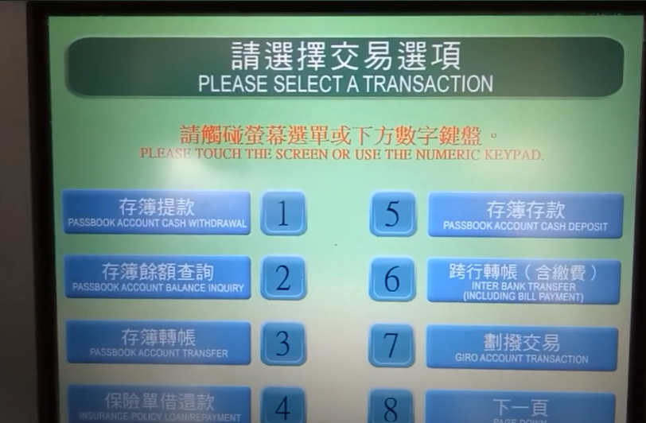
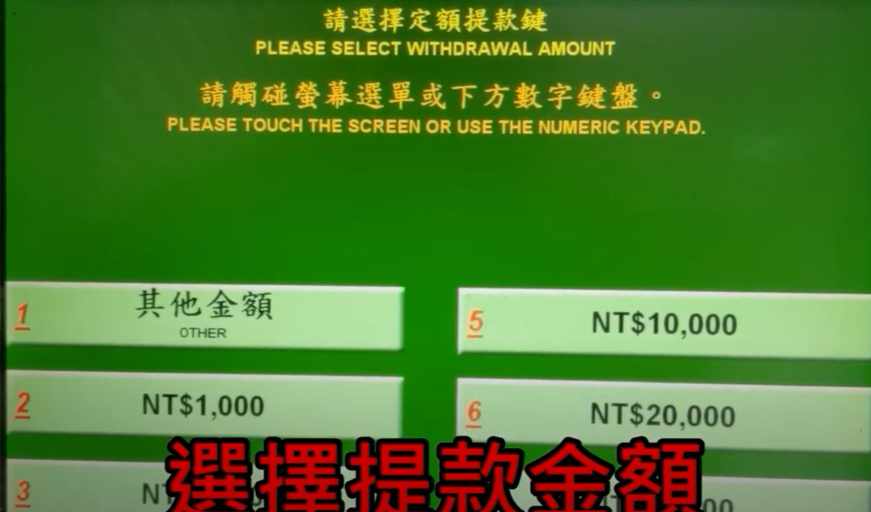
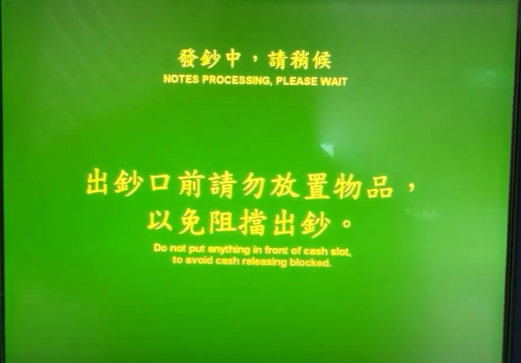
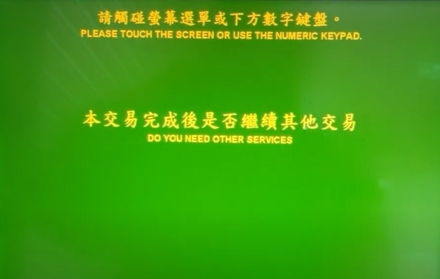
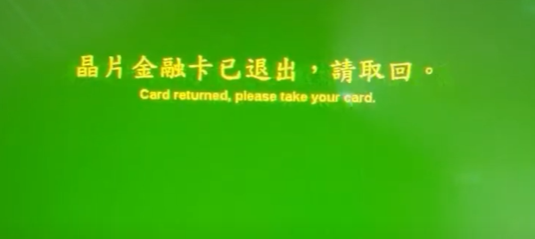
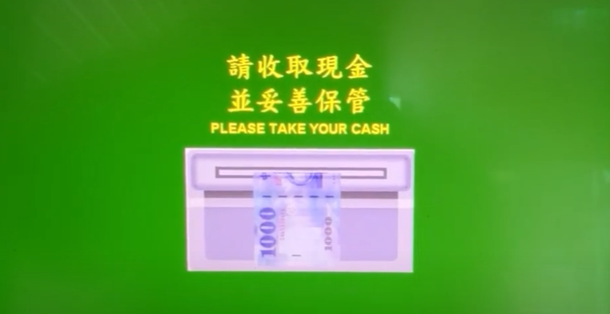

# ATM Design Evaluation-Chunghwa POST

## Introduction

When Arvind was introducing the cognitive walkthrough of Bank of America ATM, I was really surprised by how many confusions it might caused for the first time user. 

I am from Taiwan, and the ATMs in my country do not have any of the problem described in the lecture, and today I would like to also do a cognitive walkthrough and comparison between Taiwan Post Office's (Chunghwa POST) ATM and BoFA's ATM.

## Cognitive Walkthrough

1. Insert Debit Card

|Question | Chunghwa POST |
| -----------------| ----------- | 
| Know they need to do? | Yes, they do have a sensor in front of the ATM, which shows messages, animations, and voice such as "please insert your card" once it detects people.   | 
| Correct option is available? | Yes, the screen will show a example figure of inserting your card. The slot is labelled "Take Card" and has an icon showing the chip should face above. The English translation is a little off in my opinion, since the Mandarin says "card slot" literally.| 
| Know right thing to have done? | Yes, the machine will say "reading card, please wait" and show the message on the screen.|
| Know they make progress? |Yes, also from the message by the ATM.| 

2. Enter PIN Number

|Question | Chunghwa POST |
| -----------------| ----------- | 
| Know they need to do? |  Clear message on the screen, and the ATM will read the instruction at the same time.| 
| Correct option is available? | Yes, the number keyboard is the only thing on the ATM that has numbers on it. Also, the "Accept" green button is right next to the number keypad.| 
| Know right thing to have done? | Yes, symbols show up everytime you key in a number.|
| Know they make progress? | Yes, if you key in the wrong number, it will be rejected. Else, you can select what you would like to do with your account.| 

3. Tap $40 on the Screen

|Question | Chunghwa POST |
| -----------------| ----------- | 
| Know they need to do? |  The screen shows you clear message, where pressing the pinpad or touch screen both work.| 
| Correct option is available? | Yes, it is very straightforward.| 
| Know right thing to have done? |  Yes!|
| Know they make progress? | Yes, same as above, you can see a message.| 

4. After that...

This is an interesting design choice. Despite the ATM says "notes processing" and you can hear the sound of cash flipping, ATM will not give you the money right away. Instead, it ask you if you need any other service. Despite ATM does not want to give you the money before you decide the terminate the service, the "Notes Processing" message in the previous step still provides the user that one is making progress.

Similar to BoFA ATM, it also returns the debit card first then cash.

Also note that Chunghwa POST does not provide credit card service, so the card here is referring to debit card.

## Summary

The ATM in Taiwan gives more message for user, including messages on the screen, the voice reading the instruction, and the label and icon for card slot/ cash on ATM. During the cognitive walkthrough, it also provides clear instruction in each stage and give feedback after every user's operation.

The way that they give a message even if that specific action will not be done, for example, even when notes processing but not dispensing yet, ATM provides a message, which makes me wondering if they actually did those analysis.

## References

- https://news.secom.com.tw/articles/%E4%BB%8A%E5%B9%B4%E6%8F%9B%E6%96%B0%E9%88%94%E9%99%90%E6%99%825%E5%A4%A9%E5%85%A8%E5%8F%B0454%E5%80%8B%E6%8F%9B%E9%88%94%E5%9C%B0%E9%BB%9E%E8%BC%95%E9%AC%86%E6%9F%A5
- https://news.tvbs.com.tw/life/1190086
- https://www.youtube.com/watch?v=NfLjTflUr1s&t=30s