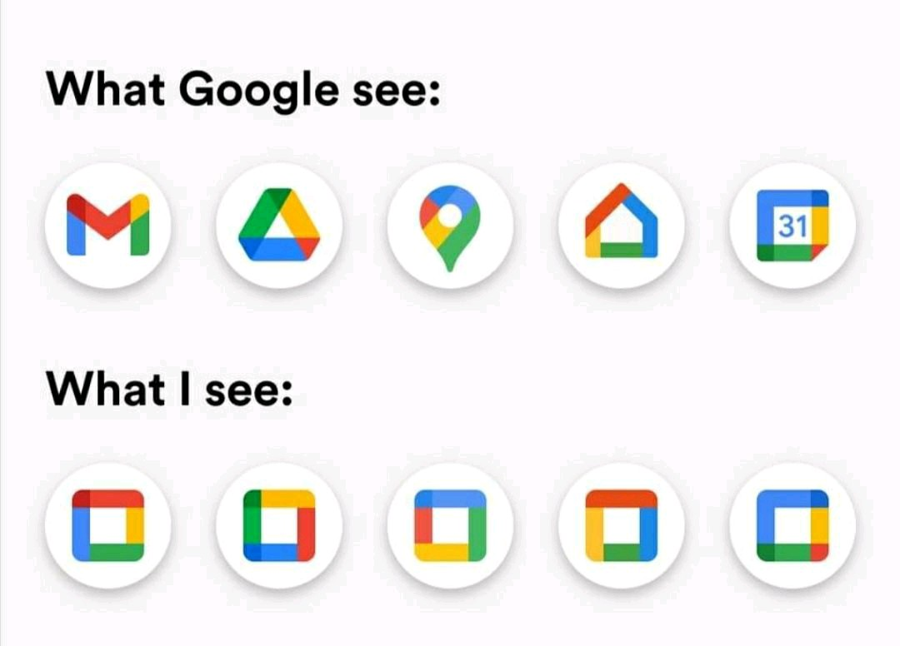
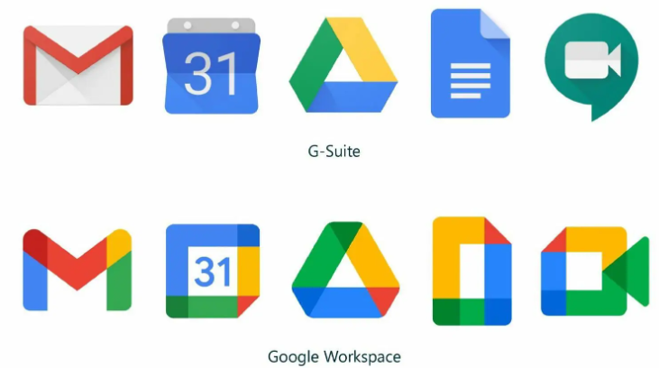
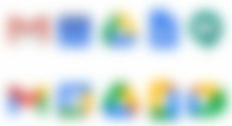
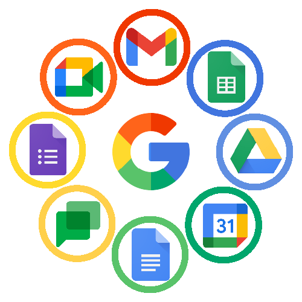
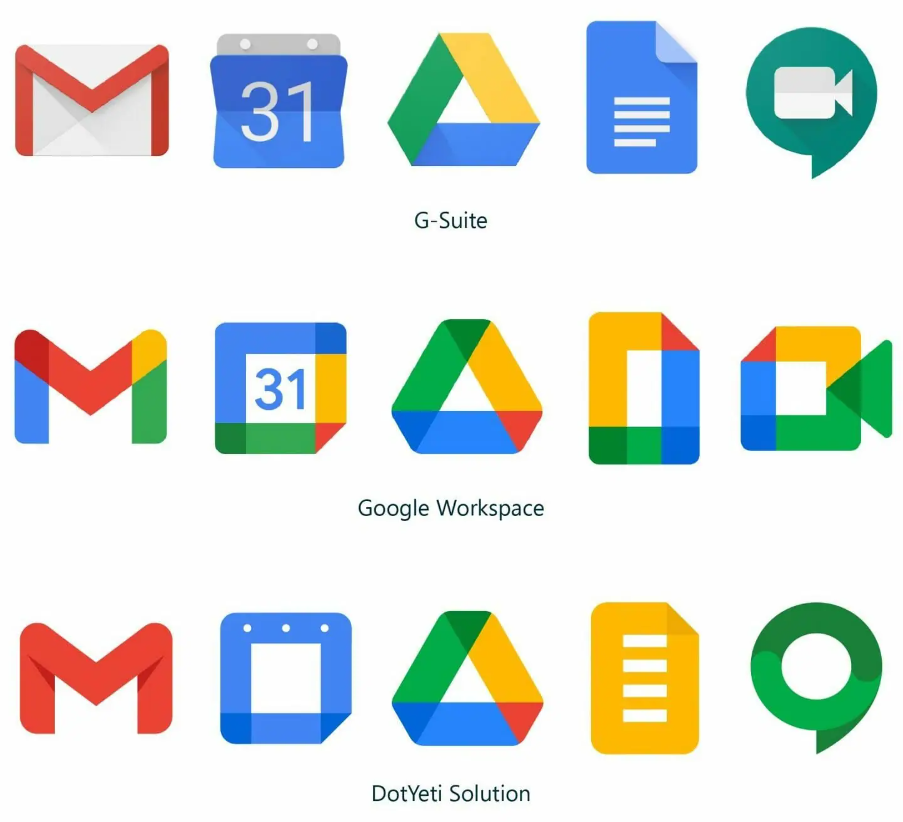

# Google Applications Icon Redesign

## Introduction

When Arvind was introducing "consistent naming & icons," where Google Drive grid view icon and Google apps view icon looked similar, a meme(?) struct to my mind:

These are Google's 2020 redesign of its apps logos, and this concept visually unifys the logos with Google's signature color palette (blue, red, yellow, and green) for each app. 

Hmm, it looked very different. Below, I have organized and thought some of the pros and cons of this redesign. 

## Pros

1. Unifying Visually
> Just as what Arvind has discussed in class, though these icons are not directly inside an application, but when you are using your cellphone and saw one of those appllications, you can immediately identify this is one of the Google applications based on its classic blue, red, yellow, and green color palette.

2. Looks Trendy!
> Referencing the original icons, these minimalist designs simplified shades and unnecessary lines. The new icons looked modern and clean, which had potential to attract user and enhance company brand.

3. Implication of Application Usage
> VP and GM of Google Workspace Javier Soltero viewed the transition from G-suite to Google Workspace as a stronger relationship across different applications, so does the logo redesign. Hence, this visual redesign was implying the increasing collaboration capability in Google Workspace.

## Cons

Many designers did not like this design, and so did many of the users. Here are some analysis that I made and I found on the Internet.

1. Blur Test

> If you blur the icons, which I think to be a good approximation of a quick glance to your phone, where the G-suite logos are easily distinquishable and Google Workspace logos look similar. Of course, you can still tell if you look closer, but it will be seen as inconvenience to the users.

2. Less Expressive

> The best ways to identify whether a design is expressive is to show it to the new users, which Arvind had similar conversation in lecture. For an infrequent phone user, there is no way that one can identify the new Google Docs icons. The Gmail icon also removed its original envelope shape, which might be confusing.

## More Redesign/ Summary

Apparently, this redesign had sparked a wide range of opinions, and Google has done some modifications to strike a balance between being minimalist and expressive.

The main purpose of design of these icons is to let people use it; of course, it is better if it looks trendy. There was also a page that did the redesign, but made sure the visualization is clear at the same time. The key is to retain significant characteristics and simplify the unwanted part. For example, in the Gmail icon, the classic red and the shadow under the envelope flip are kept in this redesign by DotYeti.

## References

- https://www.dotyeti.com/blog/we-fixed-googles-new-logos-2020/
- https://www.linkedin.com/posts/jsoltero_googleworkspace-activity-6719278760681721856-2LNs?utm_source=share&utm_medium=member_desktop
- https://www.pcschool.com.tw/blog/designer/google-appicon-2020